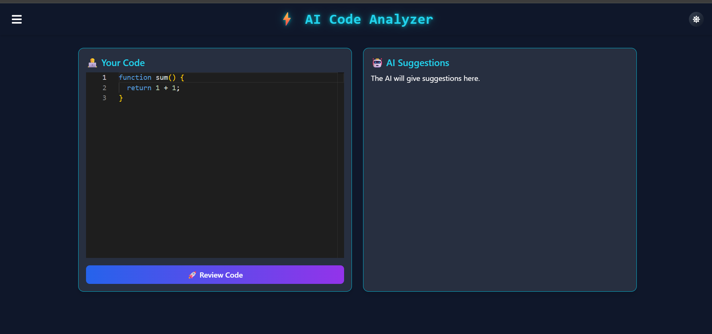
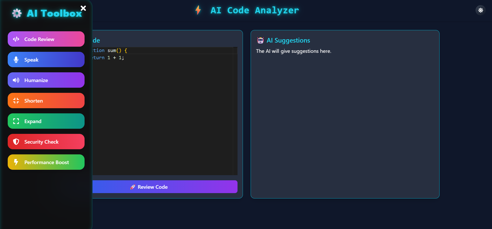

# 🤖  AI-Powered Code Quality Analyzer – MERN Stack Project

An **AI-Powered-Code-Quality-Analyzer** built with the **MERN stack**, designed to help developers write better code with real-time analysis, performance feedback, security suggestions, and speech-based reviews.

> 💡 Designed for industry-level code collaboration, review automation, and enhanced developer productivity.

---

*Homepage*


*Workspace*



-- Replace with actual image path -->

---

## 🚀 Features

- ✅ **Automated Code Review** using AI (OpenAI / Gemini API)
- 🧠 **Speech-Based Review** (Text-to-Speech in Hindi/English)
- ✍️ **Humanized & Compressed Review Suggestions**
- 🚨 **Security & Performance Checks**
- 🌐 **Language Switch (English/Hindi)**
- 💬 **Real-time Code Editor with Monaco Editor**
- 📊 **Dashboard for Review Logs**
- 🎨 **Modern UI** with Neon + Glassmorphism theme
- 🔐 **User Authentication** (JWT-based)
- 🧪 **API Integration** with proper error handling

---

## 🛠️ Tech Stack

| Frontend      | Backend       | Database | AI Engine     |
|---------------|---------------|----------|----------------|
| React.js ⚛️     | Node.js + Express.js 🚀 | MongoDB 🍃 | Google Gemini API / OpenAI GPT-4 |

---

## 🎯 Modules & Highlights

### 🧑‍💻 Code Editor
- Monaco Editor with syntax highlighting.
- Live code input with AI-trigger button.

### 🗣️ AI Review Features
- `Code Review`
- `Humanized Response`
- `Short/Elongate Feedback`
- `Performance Boost Tips`
- `Security Suggestions`
- `Speech Generation` (TTS in Hindi & English)

### 🎨 UI/UX
- Futuristic dark mode with glassmorphism
- Animated buttons, toggles, and loader
- Fully responsive layout

---

### 🤖 AI Code Review Functions

| Feature                     | Description                                                                 |
|-----------------------------|-----------------------------------------------------------------------------|
| `Code Review`               | Generates professional review of your code using AI                        |
| `Sort Code`                 | Sorts messy/unstructured code automatically                                 |
| `Humanized Review`          | Converts technical feedback into human-readable suggestions                |
| `Short/Elongated Response`  | Compress or Expand review based on need                                    |
| `Performance Boost`         | Gives tips to optimize code execution and efficiency                      |
| `Security Check`            | Detects possible vulnerabilities or insecure patterns                     |
| `Speech Review`             | Converts feedback to Hindi/English audio using TTS  

| Code Editor | AI Suggestions | Speech Output |
|-------------|----------------|----------------|

---

## 🔧 Installation

### 1️⃣ Clone the Repository
```bash
git clone https://https://github.com/Abhay9322/AI-Powered-Code-Quality-Analyzer
cd AI-Powered-Code-Quality-Analyzer
